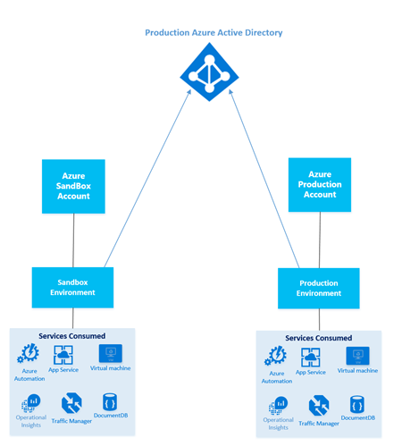
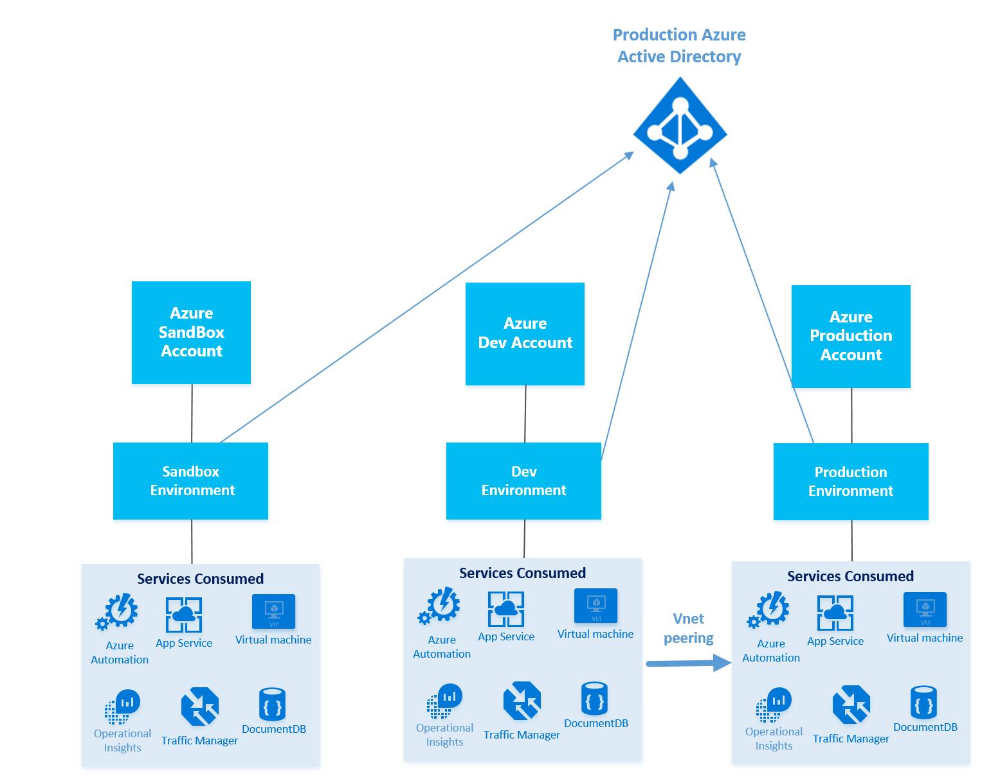

# Azure subscription design guide

## Azure subscription design patterns

There are a number of common design patterns used when planning your Azure subscriptions. These patterns are described below. 

Note that the different kinds of subscriptions discussed are conceptual and don't represent specific Azure subscription types. For example, "sandbox subscriptions" are discussed below as a concept, but this subscription could be any suitable Azure subscription type: Pay-As-You-Go, Eterprise Dev/Test, and so on.
   
### Sandbox design pattern

The sandbox subscription is likely the first subscription you will create, when you need to learn and experiment with Azure in an isolated environment that you can easily tear down and rebuild.

A sandbox subscription has the following characteristics: 

- Provides an environment for learning and experimentation for non-production workloads.
- Provides an isolated network environment.
- Supports rapid buildup and teardown of Azure infrastructure resources.
- Trusts a single Azure AD tenant.
- Has a single assigned account owner.

### Sandbox-and-production pattern

The sandbox-and-production pattern will enable you to deploy production workloads in Azureby creating a separate subscription where your production workloads will reside.

The sandbox-and-production pattern has the following characteristics:

- Each environment contains different types of applications (sandbox/non-production vs. production)
- The networks in each subscription are isolated from one another
- Virtual networks wrap the different workloads for traffic separation
- The subscriptions have different offers, and therefore different pricing models. The sandbox can often take advantage of lower cost offers such as Dev/Test subscriptions.
- Both subscriptions trust a single Azure AD tenant.

### Sandbox-and-production-with-purpose-built pattern
TODO: Find a better name

TODO: Rewrite.

The Sandbox, Production, and Purpose Built scenario is designed for:
	• This pattern include a separate production environment (purpose-built) that is separate from the main production environment
	• Each environment contains different types of applications (sandbox/non-prod, production, and purpose-built)
	• Environments will be isolated from each other
	• Virtual Networks will wrap the different applications for traffic separation
	• Each subscriptions trust 1 single Azure AD tenant.
	• Each subscription contains a separate Azure AD account owner (see Service Administrators section)

### Continuous development pattern
TODO: Continuous deployment instead?

TODO: Rewrite
This pattern maintains the sandbox subscription isolation, and production workloads, but also allows for a subscription to be used for the purpose of code promotion approaches
	• Each environment contains the different types of applications. 
	• Virtual Networks will wrap the different applications for traffic separation. 
	• Subnets will be created within each environment to establish required security isolation zones among application tiers. 
	• Each subscriptions trust 1 single Azure AD tenant.
	• Each subscription contains a separate Azure AD account owner (see Service Administrators section)
	• Dev subscription contains separate subnets and resource groups that isolate (Test, Dev and QA environments)

