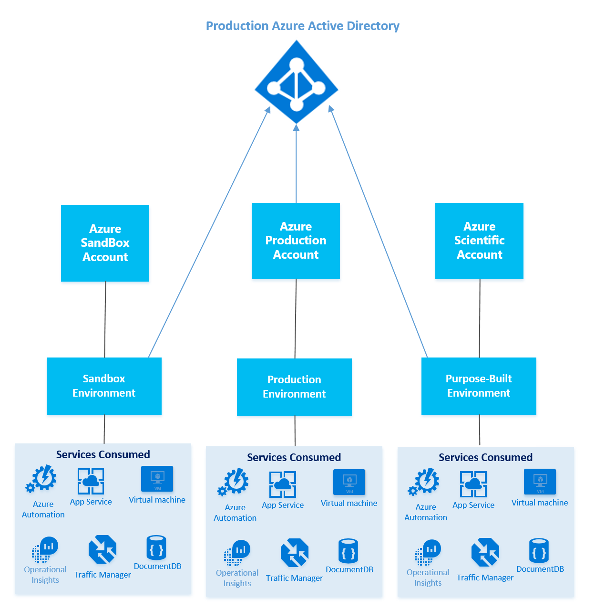

# Azure subscription design guide

## Azure subscription design patterns

There are a number of common design patterns used when planning your Azure subscriptions. These patterns are described below. 

Note that the different kinds of subscriptions discussed are conceptual and don't represent specific Azure subscription types. For example, "sandbox subscriptions" are discussed below as a concept, but this subscription can be any suitable Azure subscription type: Pay-As-You-Go, Enterprise Dev/Test, and so on.

### Sandbox design pattern

The sandbox subscription is likely the first subscription you will create, when you need to learn and experiment with Azure in an isolated environment that you can easily tear down and rebuild.

A sandbox subscription has the following characteristics: 

- Provides an environment for learning and experimentation for non-production workloads.
- Provides an isolated network environment.
- Supports rapid buildup and teardown of Azure infrastructure resources.
- Trusts a single Azure AD tenant.
- Has a single assigned account owner.

### Sandbox-and-production pattern

The sandbox-and-production pattern will enable you to deploy production workloads in Azure by creating a separate subscription where your production workloads will reside.

The sandbox-and-production pattern has the following characteristics:

- Isolates the networks in each subscription from one another.
- Segregates traffic for different workloads via virtual networks.
- Reduces costs by using a lower-cost offer type (such as Dev/Test) for the sandbox environment.
- Establishes a trust relationship for both subscriptions with a single Azure AD tenant.

### Sandbox-and-production-with-purpose-built subscription pattern
TODO: Find a better name

This pattern provides an additional subscription intended for production-ready workloads that have different governance and control requirements than either the sandbox or production environments. For example, a research project may be managed by a separate entity. This pattern can also support workloads that have different regulation requirements or different access controls.

This pattern has the following characteristics:

- Allows each environment to contain workloads with different requirements (sandbox/non-production, production, and purpose-built).
- Isolates the networks in each subscription from one another.
- Segregates traffic for different workloads via virtual networks.
- Establishes a trust relationship for each subscription with a single Azure AD tenant.
- Allows different account owners for each subscription.

### Continuous deployment pattern

Building on the previous patterns, the continuous deployment enables the use of subscriptions to support a continuous deployment strategy by promoting code through each environment.

The continuous deployment pattern has the following additional characteristics:
- Subnets created in each environment establish required security isolation zones among application tiers. 
- Dev subscription contains separate subnets and resource groups that isolate Dev, Test, and pre-production environments.

