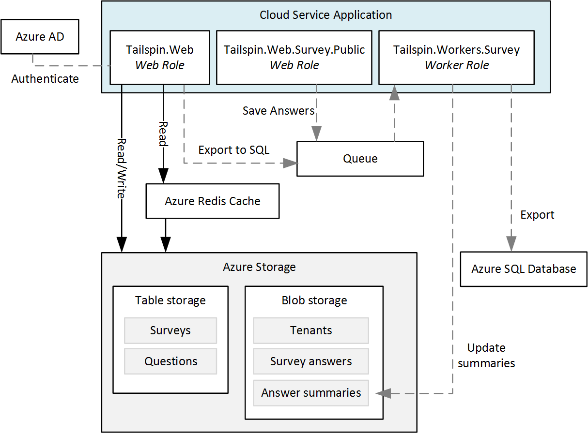
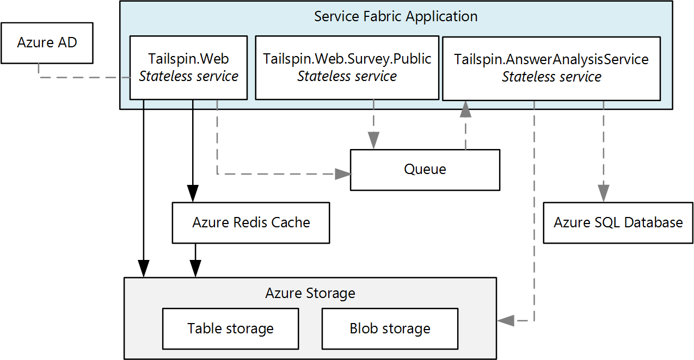
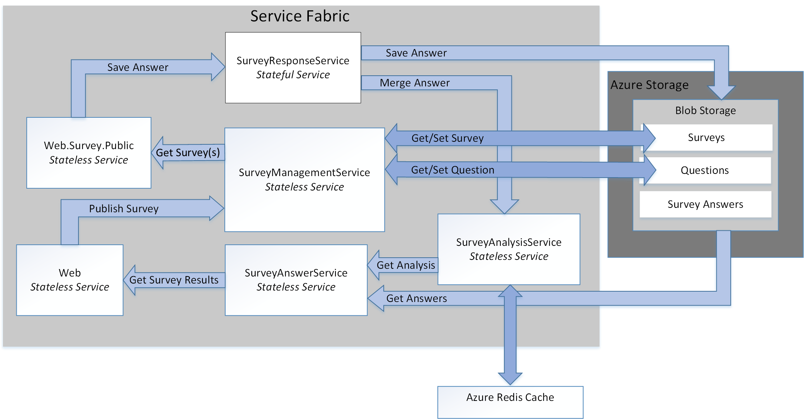

# Refactor an Azure Service Fabric Application migrated from Azure Cloud Services

[ Sample code][sample-code]

This article describes refactoring an existing Azure Service Fabric application to a more granular architecture. This article focuses on the design, packaging, performance, and deployment considerations of the refactored Service Fabric application.

## Scenario

As discussed in the previous article, [Migrating an Azure Cloud Services application to Azure Service Fabric][migrate-from-cloud-services], the patterns & practices team authored a book in 2012 that documented the process for designing and implementing a Cloud Services application in Azure. The book describes a fictitious company named Tailspin that wants to create a Cloud Services application named **Surveys**. The Surveys application allows users to create and publish surveys that can be answered by the public. The following diagram shows the architecture of this version of the Surveys application:



The **Tailspin.Web** web role hosts an ASP.NET MVC site that Tailspin customers use to:
* sign up for the Surveys application,
* create or delete a single survey,
* view results for a single survey,
* request that survey results be exported to SQL, and
* view aggregated survey results and analysis.

The **Tailspin.Web.Survey.Public** web role also hosts an ASP.NET MVC site that the public visits to fill out the surveys. These responses are put in a queue to be saved.

The **Tailspin.Workers.Survey** worker role performs background processing by picking up requests from multiple queues.

The patterns & practices team then created a new project to port this application to Azure Service Fabric. The goal of this project was to make only the necessary code changes to get the application running in an Azure Service Fabric cluster. As a result, the original web and worker roles were not decomposed into a more granular architecture. The resulting architecture is very similar to the Cloud Service version of the application:



The **Tailspin.Web** service is ported from the original *Tailspin.Web* web role.

The **Tailspin.Web.Survey.Public** service is ported from the original *Tailspin.Web.Survey.Public* web role.

The **Tailspin.AnswerAnalysisService** service is ported from the original *Tailspin.Workers.Survey* worker role.

> [!NOTE] 
> While minimal code changes were made to each of the web and worker roles, **Tailspin.Web** and **Tailspin.Web.Survey.Public** were modified to self-host a [Kestrel] web server. The earlier Surveys application is an ASP.Net application that was hosted using Interet Information Services (IIS), but it is not possible to run IIS as a service in Service Fabric. Therefore, any web server must be capable of being self-hosted, such as [Kestrel]. It is possible to run IIS in a container in Service Fabric in some situations. See [scenarios for using containers][container-scenarios] for more information.  

Now, Tailspin is refactoring the Surveys application to a more granular architecture. Tailspin's motivation for refactoring is to make it easier to develop, build, and deploy the Surveys application. By decomposing the existing web and worker roles to a more granular architecture, Tailspin wants to remove the existing tightly coupled communication and data dependencies between these roles.

Tailspin sees other benefits in moving the Surveys application to a more granular architecture:
* Each service can be packaged into independent projects with a scope small enough to be managed by a small team.
* Each service can be independently versioned and deployed.
* Each service can be implemented using the best technology for that service. For example, a service fabric cluster can include services built using different versions of the .Net Frameworks, Java, or other languages such as C or C++.
* Each service can be independently scaled to respond to increases and decreases in load.

> [!NOTE] 
> Multitenancy is out of scope for the refactoring of this application. Tailspin has several options to support multitenancy and can make these design decisions later without affecting the initial design. For example, Tailspin can create separate instances of the services for each tenant within a cluster or create a separate cluster for each tenant.

## Design considerations
 
The following diagram shows the architecture of the Surveys application refactored to a more granular architecture:



**Tailspin.Web** is a stateless service self-hosting an ASP.NET MVC application that Tailspin customers visit to create surveys and view survey results. This service shares most of its code with the *Tailspin.Web* service from the ported Service Fabric application. As mentioned earlier, this service uses ASP.NET core and switches from using Kestrel as web frontend to implementing a WebListener.

**Tailspin.Web.Survey.Public** is a stateless service also self-hosting an ASP.NET MVC site. Users visit this site to select surveys from a list and then fill them out. This service shares most of its code with the *Tailspin.Web.Survey.Public* service from the ported Service Fabric application. This service also uses ASP.NET Core and also switches from using Kestrel as web frontend to implementing a WebListener.

**Tailspin.SurveyResponseService** is a stateful service that stores survey answers in Azure Blob Storage. It also merges answers into the survey analysis data. The service is implemented as a stateful service because it uses a [ReliableConcurrentQueue][reliable-concurrent-queue] to process survey answers in batches. This functionality was originally implemented in the *Tailspin.AnswerAnalysisService* service in the ported Service Fabric application.

**Tailspin.SurveyManagementService** is a stateless service that stores and retrieves surveys and survey questions. The service uses Azure Blob storage. This functionality was also originally implemented in the data access components of the *Tailspin.Web* and *Tailspin.Web.Survey.Public* services in the ported Service Fabric application. Tailspin refactored the original functionality into this service to allow it to scale independently.

**Tailspin.SurveyAnswerService** is a stateless service that retrieves survey answers and survey analysis. The service also uses Azure Blob storage. This functionality was also originally implemented in the data access components of the *Tailspin.Web* service in the ported Service Fabric application. Tailspin refactored the original functionality into this service because it expects less load and wants to use fewer instances to conserve resources.

**Tailspin.SurveyAnalysisService** is a stateless service that persists survey answer summary data in a Redis cache for quick retrieval. This service is called by the *Tailspin.SurveyResponseService* each time a survey is answered and the new survey answer data is merged in the summary data. This service includes the functionality originally implemented in the *Tailspin.AnswerAnalysisService* service from the ported Service Fabric application.

## Stateless versus stateful services

Azure Service Fabric supports the following programming models:
* The guest executable model allows any executable to be packaged as a service and deployed to a Service Fabric cluster. Service Fabric orchestrates and manages execution of the guest executable.
* The container model allows for deployment of services in container images. Service Fabric supports creation and and management of containers on top of Linux kernel contains as well as Windows Server containers. 
* The reliable services programming model allows for the creation of stateless or stateful services that integrate with all Service Fabric platform features. Stateful services allow for replicated state to be stored in the Service Fabric cluster. Stateless services do not.
* The reliable actors programming model allows for the creation of services that implement the virtual actor pattern.

All the services in the Surveys application are stateless reliable services, except for the *Tailspin.SurveyResponseService* service. This service implements a [ReliableConcurrentQueue][reliable-concurrent-queue] to process survey answers when they are received. Responses in the ReliableConcurrentQueue are saved into Azure Blob Storage and passed to the *Tailspin.SurveyAnalysisService* for analysis. Tailspin chooses a ReliableConcurrentQueue because responses do not require strict first-in-first-out (FIFO) ordering provided by a queue such as Azure Service Bus. A ReliableConcurrentQueue is also designed to deliver high throughput and low latency for queue and dequeue operations.

Note that operations to persist dequeued items from a ReliableConcurrentQueue should ideally be idempotent. If an exception is thrown during the processing of an item from the queue, the same item may be processed more than once. In the Surveys application, the operation to merge survey answers to the *Tailspin.SurveyAnalysisService* is not idempotent because Tailspin decided that the survey analysis data is only a current snapshot of the analysis data and does not need to be consistent. The survey answers saved to Azure Blob Storage are eventually consistent, so the survey final analysis can always be recalculated correctly from this data.

## Communication framework

Each service in the Surveys application communicates using a RESTful web API. RESTful APIs offer the following benefits:
* Ease of use: each service is built using ASP.Net Core MVC, which natively supports the creation of Web APIs.
* Security: While each service does not require SSL, Tailspin could require each service to do so. 
* Versioning: clients can be written and tested against a specific version of a web API.

Services in the Survey application make use of the [reverse proxy][reverse-proxy] implemented by Service Fabric. Reverse proxy is a service that runs on each node in the Service Fabric cluster and provides endpoint resolution, automatic retry, and handles other types of connection failures. To use the reverse proxy, each RESTful API call to a specific service is made using a predefined reverse proxy port.  For example, if the reverse proxy port has been set to **19081**, a call to the *Tailspin.SurveyAnswerService* can be made as follows:

```csharp
static SurveyAnswerService()
{
    httpClient = new HttpClient
    {
        BaseAddress = new Uri("http://localhost:19081/Tailspin/SurveyAnswerService/")
    };
}
```
To enable reverse proxy, specify a reverse proxy port during creation of the Service Fabric cluster. For more information, see [reverse proxy][reverse-proxy] in Azure Service Fabric.

## Performance considerations

Tailspin created the ASP.NET Core services for *Tailspin.Web* and *Tailspin.Web.Surveys.Public* using Visual Studio templates. By default, these templates include logging to the console. Logging to the console may be done during development and debugging, but all logging to the console should be removed when the application is deployed to production.

> [!NOTE]
> For more information about setting up monitoring and diagnostics for Service Fabric applications running in production, see [monitoring and diagnostics][monitoring-diagnostics] for Azure Service Fabric.

For example, the following lines in *startup.cs* for each of the web front end services should be commented out:

```csharp
// This method gets called by the runtime. Use this method to configure the HTTP request pipeline.
public void Configure(IApplicationBuilder app, IHostingEnvironment env, ILoggerFactory loggerFactory)
{
    //loggerFactory.AddConsole(Configuration.GetSection("Logging"));
    //loggerFactory.AddDebug();

    app.UseMvc();
}
```

> [!NOTE]
> These lines may be conditionally excluded when Visual Studio is set to “release” when publishing.

Finally, when Tailspin deploys the Tailspin application to production, they switch Visual Studio to **release** mode.

## Deployment considerations

The refactored Surveys application is composed of five stateless services and one stateful service, so cluster planning is limited to determining the correct VM size and number of nodes. In the *applicationmanifest.xml* file that describes the cluster, Tailspin sets the *InstanceCount* attribute of the *StatelessService* tag to -1 for each of the services. A value of -1 directs Service Fabric to create an instance of the service on each node in the cluster.

> [!NOTE]
> Stateful services require the additional step of planning the correct number of partitions and replicas for their data.

Tailspin deploys the cluster using the Azure Portal. The Service Fabric Cluster resource type deploys all of the necessary infrastructure, including VM scale sets and a load balancer. The recommended VM sizes are displayed in the Azure portal during the provisioning process for the Service Fabric cluster. Note that because the VMs are deployed in a VM scale set, they can be both scaled up and out as user load increases.

> [!NOTE]
> As discussed earlier, in the migrated version of the Surveys application the two web front ends were self-hosted using ASP.Net Core and Kestrel as a web server. While the migrated version of the Survey application does not use a reverse proxy, it is strongly recommended to use a reverse proxy such as IIS, Nginx, or Apache. For more information see [introduction to Kestrel web server implementation in ASP.NET core][kestrel-intro].
> In the refactored Surveys application, the two web front ends are self-hosted using ASP.Net Core with [WebListener][weblistener] as a web server so a reverse proxy is not necessary.

## Next steps

The Surveys application code is available on [GitHub][sample-code].

If you are just getting started with [Azure Service Fabric][service-fabric], first set up your development environment then download the latest [Azure SDK][azure-sdk] and the [Azure Service Fabric SDK][service-fabric-sdk]. The SDK includes the OneBox cluster manager so you can deploy and test the Surveys application locally with full F5 debugging.

<!-- links -->
[azure-sdk]: https://azure.microsoft.com/en-us/downloads/archive-net-downloads/
[container-scenarios]: /azure/service-fabric/service-fabric-containers-overview
[kestrel]: https://docs.microsoft.com/aspnet/core/fundamentals/servers/kestrel?tabs=aspnetcore2x
[kestrel-intro]: https://docs.microsoft.com/aspnet/core/fundamentals/servers/kestrel?tabs=aspnetcore1x
[migrate-from-cloud-services]: migrate-from-cloud-services.md
[monitoring-diagnostics]: /azure/service-fabric/service-fabric-diagnostics-overview
[reliable-concurrent-queue]: /azure/service-fabric/service-fabric-reliable-services-reliable-concurrent-queue
[reverse-proxy]: /azure/service-fabric/service-fabric-reverseproxy
[sample-code]: https://github.com/mspnp/cloud-services-to-service-fabric/tree/master/servicefabric-phase-2
[service-fabric]: /azure/service-fabric/service-fabric-get-started
[service-fabric-sdk]: /azure/service-fabric/service-fabric-get-started
[weblistener]: https://docs.microsoft.com/aspnet/core/fundamentals/servers/weblistener
